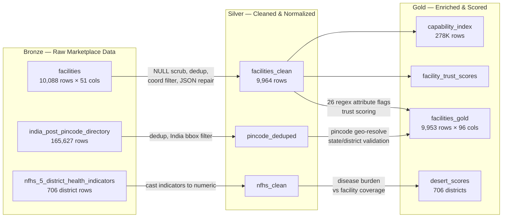
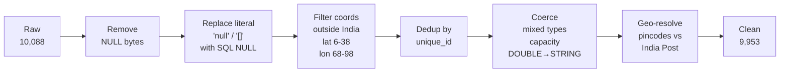
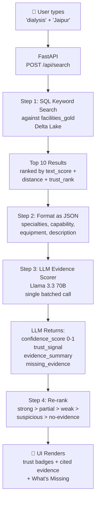
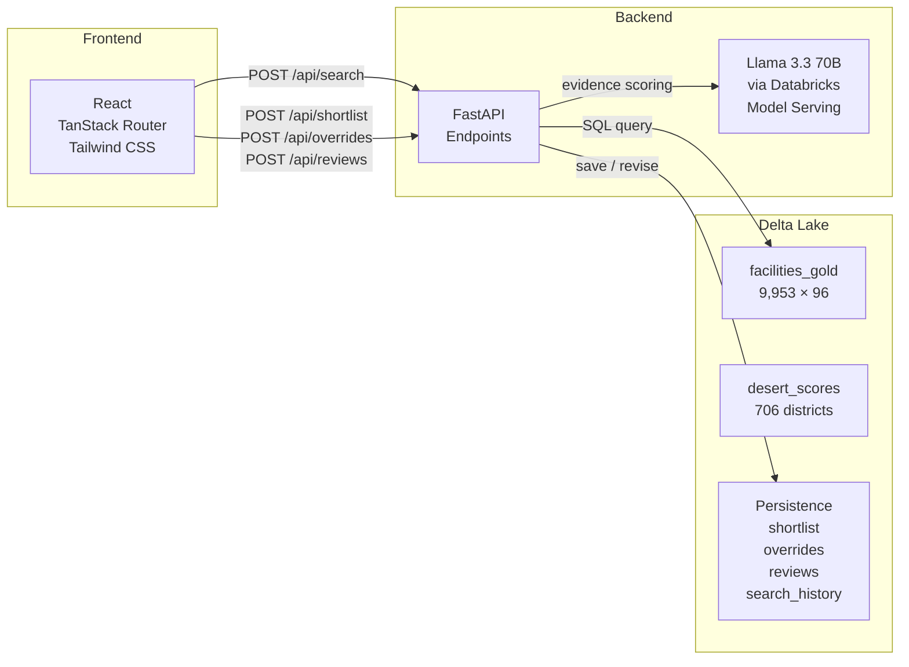
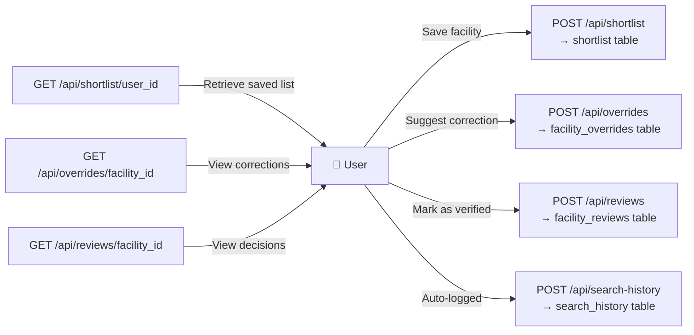

# MatchCare — Architecture & Flow (Demo Reference)

## 1. Medallion Architecture (ETL)

### How each source table is used

| Source Table | Feeds Into | Purpose |
|---|---|---|
| `facilities` | `facilities_clean` → `facilities_gold` | Core facility records — name, location, specialties, capabilities, equipment, description |
| `india_post_pincode_directory` | `pincode_deduped` → geo-resolve in `facilities_gold` | Validates pincodes against official India Post data. Cross-checks state vs pincode first-digit zone. Produces `pincode_confidence` and `needs_geo_review` flags. 582 facilities flagged for mismatch. |
| `nfhs_5_district_health_indicators` | `nfhs_clean` → `desert_scores` | District-level disease burden (anaemia %, institutional birth %, insurance coverage %). Joined with facility density to compute healthcare "desert" scores — high burden + low trusted-facility coverage = underserved district. |

### Data cleaning steps

---

## 2. Search Flow (per user query)

### What happens at each step

**Step 1 — SQL Keyword Search**
- Weighted LIKE match across 6 text columns: name (×3), description (×1), specialties (×2.5), capability (×1.5), procedure (×1.5), equipment (×1)
- Blended with haversine distance decay from Jaipur coordinates
- Boosted by pre-computed `trust_rank` from ETL
- Returns top 20, trimmed to top 10 for LLM

**Step 2 — Format as JSON**
- Each facility row becomes a compact card: name, type, location, specialties, capabilities, procedures, equipment, description, source, per-field signals
- The LLM never touches the database — it only sees what we feed it

**Step 3 — LLM Evidence Scorer**
- Single batched call to Llama 3.3 70B with all 10 facility cards
- System prompt forces 4-step reasoning: (1) What sources confirm this capability? (2) Are sources independent? (3) Does facility type match the claim? (4) What data is missing?
- Returns per-facility: `confidence_score`, `trust_signal`, `evidence_summary`, `missing_evidence`
- If LLM fails → rule-based scores stay intact. Search never breaks.

**Step 4 — Re-rank**
- Sort by tier first (strong always above partial, regardless of %)
- Within same tier, sort by confidence_score descending
- Tiebreaker: original keyword relevance

---

## 3. Tech Stack

---

## 4. Persistence (Save / Revise)

