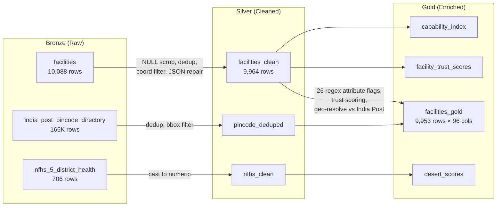
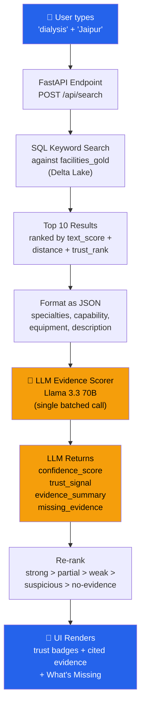
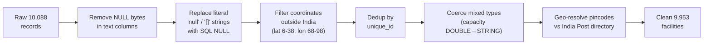
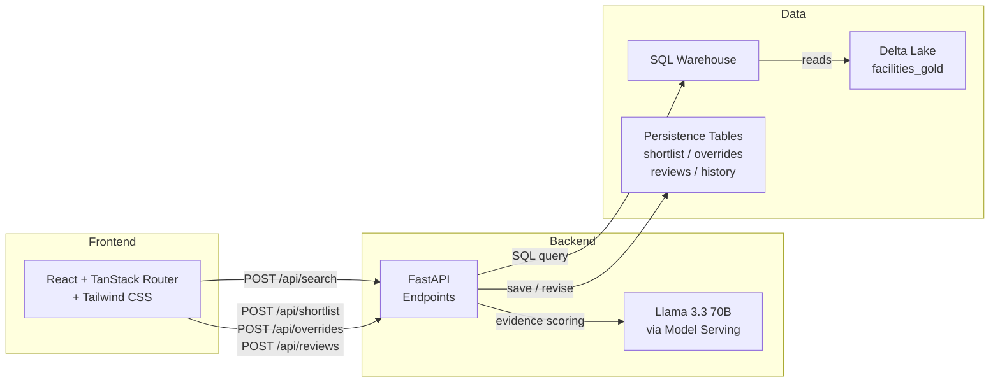

# MatchCare — Architecture & Flow (Demo Reference)

## Medallion Architecture (ETL)

```mermaid
flowchart LR
    subgraph Bronze["Bronze (Raw)"]
        B1[facilities\n10,088 rows]
        B2[india_post_pincode_directory\n165K rows]
        B3[nfhs_5_district_health\n706 rows]
    end

    subgraph Silver["Silver (Cleaned)"]
        S1[facilities_clean\n9,964 rows]
        S2[pincode_deduped]
        S3[nfhs_clean]
    end

    subgraph Gold["Gold (Enriched)"]
        G1[facilities_gold\n9,953 rows × 96 cols]
        G2[facility_trust_scores]
        G3[desert_scores]
        G4[capability_index]
    end

    B1 -->|"NULL scrub, dedup,\ncoord filter, JSON repair"| S1
    B2 -->|"dedup, bbox filter"| S2
    B3 -->|"cast to numeric"| S3

    S1 -->|"26 regex attribute flags,\ntrust scoring,\ngeo-resolve vs India Post"| G1
    S1 --> G2
    S2 --> G1
    S3 --> G3
    S1 --> G4
```

## Search Flow (per query)

```mermaid
flowchart TD
    A["👤 User types\n'dialysis' + 'Jaipur'"]
    B["FastAPI Endpoint\nPOST /api/search"]
    C["SQL Keyword Search\nagainst facilities_gold\n(Delta Lake)"]
    D["Top 10 Results\nranked by text_score +\ndistance + trust_rank"]
    E["Format as JSON\nspecialties, capability,\nequipment, description"]
    F["🤖 LLM Evidence Scorer\nLlama 3.3 70B\n(single batched call)"]
    G["LLM Returns\nconfidence_score\ntrust_signal\nevidence_summary\nmissing_evidence"]
    H["Re-rank\nstrong > partial > weak >\nsuspicious > no-evidence"]
    I["📱 UI Renders\ntrust badges + cited evidence\n+ What's Missing"]

    A --> B
    B --> C
    C --> D
    D --> E
    E --> F
    F --> G
    G --> H
    H --> I

    style A fill:#2563eb,color:#fff
    style F fill:#f59e0b,color:#000
    style G fill:#f59e0b,color:#000
    style I fill:#2563eb,color:#fff
```

## Data Cleaning Summary

```mermaid
flowchart LR
    RAW["Raw 10,088\nrecords"] --> C1["Remove NULL bytes\nin text columns"]
    C1 --> C2["Replace literal\n'null' / '[]' strings\nwith SQL NULL"]
    C2 --> C3["Filter coordinates\noutside India\n(lat 6-38, lon 68-98)"]
    C3 --> C4["Dedup by\nunique_id"]
    C4 --> C5["Coerce mixed types\n(capacity DOUBLE→STRING)"]
    C5 --> C6["Geo-resolve pincodes\nvs India Post directory"]
    C6 --> CLEAN["Clean 9,953\nfacilities"]
```

## Key Tech Stack

```mermaid
flowchart LR
    subgraph Frontend
        UI[React + TanStack Router\n+ Tailwind CSS]
    end

    subgraph Backend
        API[FastAPI\nEndpoints]
        LLM[Llama 3.3 70B\nvia Model Serving]
    end

    subgraph Data
        DL[Delta Lake\nfacilities_gold]
        WH[SQL Warehouse]
        PT[Persistence Tables\nshortlist / overrides\nreviews / history]
    end

    UI -->|"POST /api/search"| API
    API -->|"SQL query"| WH
    WH -->|"reads"| DL
    API -->|"evidence scoring"| LLM
    API -->|"save / revise"| PT
    UI -->|"POST /api/shortlist\nPOST /api/overrides\nPOST /api/reviews"| API
```
